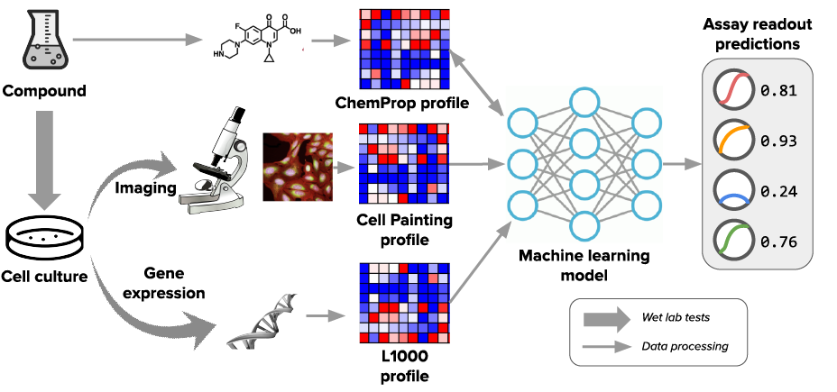

# Predicting compound activity from phenotypic profiles and chemical structures

The code release: 

The related preprint [Predicting compound activity from phenotypic profiles and chemical structures](https://www.biorxiv.org/content/10.1101/2020.12.15.422887). 

## The dataset, which includes all the related data is on Zenodo

## Experimental setup

# The overview structure of the project

    .
    ├── analysis            Jupyter and R notebooks for analysis and plotting
    ├── assay_data          Assay matrix, and lists with broad_ids\SMILES
    ├── plots               Some of the produced plots
    ├── predictions         Prediction files: aggregated. Raw files are too big for GitHub, all prediction files are available on Zenodo (dataset).
    ├── python              Python scripts for specific tasks.
    ├── scripts             Training and prediction shell and python scripts (for running ChemProp).
    ├── LICENSE
    └── README.md

 # Analysis notebooks

    ├── analysis  Jupyter and R notebooks for analysis and plotting
        ├── 01-PUMA_feature_transform  Example of how sphering batch correction was done for morphological data.
        ├── 02-dataset-filtering  Example of how data filtering was performed with hierarchical clustering (for assays) and PAINS\hit frequency (for compounds). We share already filtered assay data: 270 assays and 16170 compounds. 
        ├── 03-generate_splits_and_UMAP This notebook is used to generate training-validation scripts for different types of experiments, some dataset stats and UMAP plots.
        ├── 04-late_fusion Generate late fusion predictions.
        ├── 05-tables_for_HitRates_plot Generate tables with hit rates and top-rank hit rates. Used in the next notebook.
        ├── 06-Hit-Rates_EF Enrichment factor plots as in Supplementary Figure 7.
        ├── 07-assay_modality_AUC_plots Generate plots with correlations between training data size and AUC scores. 
        ├── 08-exceed_auc Generate cluster map plots as in Supplementary Figure 14.
        ├── 19-Venn_diagrams Generate Venn diagrams for single and combined modalities. 
        ├── 10-AUC_comparison Generate plots for Supplementary Figure 4 of the paper (also figure 2A) to compare the AUROC scores of single modalities. 
        ├── 11-Figure_auc R notebook to generate single assay ROC plots as in Figure 4. 
        ├── 12-Boxplots Generate boxplots for single and combined modalities. 

 # Figures to data-scripts-notebooks or dataset
 This section points to the data and code that was used to generate specific figures. Also, see the previous section for the description of the analysis notebooks.
- Figure 1B Can be generated with assay metadata `./assay_data/assay_metadata.csv`, which also can be found in the Excel file (see paper's dataset on Zenodo).
- Figure 1C This data is obtained with help of notebook `./analysis/03-generate_splits_and_UMAP.ipynb`.
- Figure 1D That is the final plot of `./analysis/02-dataset-filtering.ipynb`, similar plots can be produced with `./analysis/08-exceed_auc.ipynb`.
- Figure 1E Generated in `./analysis/03-generate_splits_and_UMAP.ipynb`.
- Figure 1F This data can be found in the Excel file (see paper's dataset on Zenodo).
- Figure 2A Generated in `./analysis/10-AUC_comparison.ipynb` with `predictions/scaffold_median_AUC.csv`.
- Figure 2B Generated in `./analysis/09-Venn_diagrams.ipynb` with `predictions/scaffold_median_AUC.csv` (Venn diagram) and Excel file (bar plots, see paper's dataset on Zenodo).
- Figure 2C Generated in `./analysis/12-Boxplots.ipynb`, also see script `./python/mean_and_median.py` and data `predictions/scaffold_median_AUC.csv`.
- Figure 2D See Excel file (see paper's dataset on Zenodo) and `predictions/scaffold_median_AUC.csv`). 
- Figure 2E See Excel file (see paper's dataset on Zenodo).    
- Figure 3A Generated in `./analysis/09-Venn_diagrams.ipynb` with `predictions/scaffold_median_AUC.csv` (Venn diagram) and Excel file (bar plots, see paper's dataset on Zenodo).
- Figure 3B See Excel file (see paper's dataset on Zenodo).
- Figure 3C See data `predictions/scaffold_median_AUC.csv`.
- Figure 3D Obtained with `./python/retrospective.py`
- Figure 3E Generated in `./analysis/12-Boxplots.ipynb`, also see script `./python/mean_and_median.py` and data `predictions/scaffold_median_AUC.csv`.
- Figure 4 - Generated `./analysis/12-Figure_auc.Rmd` with prediction files (see paper's dataset on Zenodo).
- Supplementary Figure 3 Generated in `./analysis/09-Venn_diagrams.ipynb` with `predictions/scaffold_median_AUC.csv` (Venn diagram) and Excel file (bar plots, see paper's dataset on Zenodo), retrospective data with `./python/retrospective.py`.
- Supplementary Figure 4 Generated in `./analysis/07-assay_modality_AUC_plots.ipynb` with `predictions/scaffold_median_AUC.csv`.
- Supplementary Figure 5 Generated in `./analysis/10-AUC_comparison.ipynb`.
- Supplementary Figure 7 Generated in `./analysis/06-Hit_Rates_EF.ipynb`, the output of `./analysis/05-tables_for_HitRates_plot.ipynb` is needed.
- Supplementary Figure 8 Generated in `./analysis/07-assay_modality_AUC_plots.ipynb`.
- Supplementary Figure 10 B and C are generated in `./analysis/03-generate_splits_and_UMAP.ipynb`, A was generated separately, see also `01-PUMA_feature_transform.ipynb`. The left plot in A is before batch correction (file `population_normalized.csv.gz` in the paper's dataset on Zenodo), and right after batch correction.
- Supplementary Figure 11 Scripts `plot_all_sim.py` and `plots_m.py`. The input data for those scripts can be found in the paper's dataset on Zenodo.
- Supplementary Figure 12 See Excel file (see paper's dataset on Zenodo).
- Supplementary Figure 13 That is the final plot of `./analysis/02-dataset-filtering.ipynb`, similar plots can be produced with `./analysis/08-exceed_auc.ipynb`.
- Supplementary Figure 14 Generated with `./analysis/08-exceed_auc.ipynb`.
- Supplementary Figure 15 Can be generated with assay metadata `./assay_data/assay_metadata.csv`, which also can be found in the Excel file (see paper's dataset on Zenodo).

*Excel file is in `/misc/Tables for PUMA.xlsx` in paper's Zenodo dataset. 
